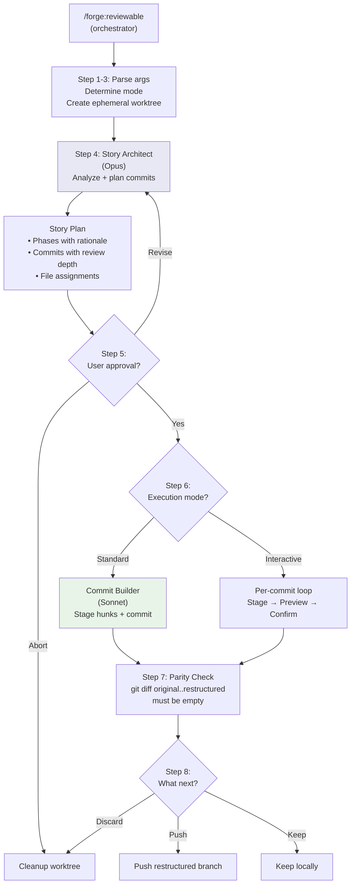
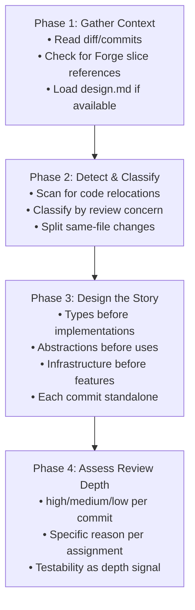
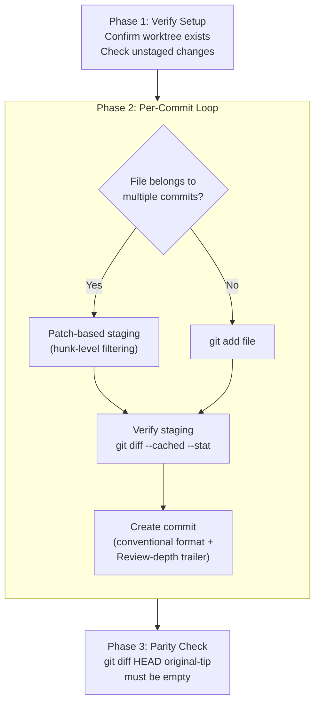

# Commit Restructuring Workflow

The `/forge:reviewable` command transforms a working
branch — whether uncommitted changes or a messy commit
history — into a sequence of atomic, reviewable commits
organized by **review concern**, not by file proximity.

---

## Why Review Concerns?

Traditional commit organization groups by file or module.
Forge groups by the **thinking required from the reviewer**:

| Concern | Commit Type | Reviewer Thinking |
|---------|-------------|-------------------|
| Configuration | `chore` | Structured correctly? Defaults? |
| Data layer | `feat`/`refactor` | Schema right? Migrations safe? |
| Observability | `chore` | Right signals? Passive only? |
| Auth/Authz | `feat` | Secure? Access controlled? |
| Testing | `test` | Right cases? Edge cases? |
| Build/Packaging | `chore` | Artifact correct? Deps right? |

This means changes in the **same file** may land in
**different commits** if they serve different review
concerns. A schema migration and a logging addition
in the same file require different reviewer thinking,
so they belong in separate commits.

---

## Review Depth Classification

Each commit is assigned a review depth that tells the
reviewer how much attention it needs:

| Depth | Triggers | Reviewer Action |
|-------|----------|-----------------|
| **high** | Behavior, architecture, security, integration-only testable | Deep focus |
| **medium** | Tests, error handling, integration wiring, significant refactors | Normal review |
| **low** | Pure moves, formatting, dep bumps, scaffolding, docs | Quick scan |

A key signal: changes verifiable only through integration
or E2E tests escalate to **high** — the human reviewer is
the safety net for what automated tests can't catch.

The depth is specific to the change, not the category.
A `feat:` adding a CSS class is low depth; a `refactor:`
restructuring an auth pipeline is high.

---

## The Pipeline

The command orchestrates two specialized agents in
sequence, with user approval gates between them.



### Mode Detection

The command accepts various input patterns and determines
the operating mode automatically:

| Input | Mode |
|-------|------|
| No args (with changes) | A: uncommitted changes |
| PR number or URL | B: historical rebase |
| Commit hash | B: historical rebase |
| Directory path | A: uncommitted changes |

**Mode A** captures uncommitted changes via `git diff`,
applies them to the ephemeral worktree, then restructures.

**Mode B** computes the cumulative diff from the merge
base, applies it to the worktree as unstaged modifications,
then restructures.

---

## Story Architect

The Story Architect (Opus) is a read-only analyst. It
never executes git commands — it designs the narrative.



### The Storytelling Principle

Commits build understanding like a painter adding layers:

1. **Sketch** — types, interfaces, signatures (stubs)
2. **Block in** — core implementations
3. **Detail** — refinements, edge cases, integration
4. **Polish** — cleanup, docs, final touches

### The Move + Enhance Pattern

When code is relocated AND modified, the architect splits
into two mandatory commits:

1. **Pure relocation** (low depth) — move only, no
   behavior change
2. **Enhancement** (appropriate depth) — new behavior
   against the relocated code

This lets reviewers verify the move is clean before
evaluating the changes.

### The "And" Rule

If a commit description needs "and", split it. Each
commit should require one type of reviewer thinking.

---

## Commit Builder

The Commit Builder (Sonnet) executes the approved plan.
It stages hunks, creates commits, and verifies zero loss.



### Hunk-Level Staging

When a single file has changes belonging to multiple
commits, the builder uses patch-based staging:

```bash
git diff -- <file> > /tmp/full-diff.patch
# Filter to desired hunks
git apply --cached /tmp/selected-hunks.patch
```

This avoids interactive `git add -p` (which requires
terminal interaction) while achieving the same precision.

---

## Zero Loss Guarantee

The restructuring never modifies the original branch.
The guarantee is enforced through dual-branch comparison:

1. **Original branch tip** recorded before any work begins
2. **Ephemeral worktree** created at the merge base
3. All changes applied and restructured in the worktree
4. **Parity check**: `git diff <original-tip> <restructured-tip>`
   must produce an empty diff

If the parity check fails unexpectedly, the worktree is
preserved for investigation and the original branch
remains untouched.

In interactive mode, intentionally skipped commits are
tracked separately so the parity check can distinguish
expected differences from data loss.

---

## Commit Message Format

Every restructured commit follows the conventional commit
format with review metadata:

```
<type>(<scope>): <subject>

<body explaining WHY>

Review-depth: <high|medium|low>
Review-reason: <one-line specific reason>
```

The `Review-depth` and `Review-reason` trailers tell
reviewers where to focus attention and why each commit
warrants its assigned depth level.
