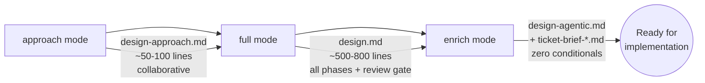
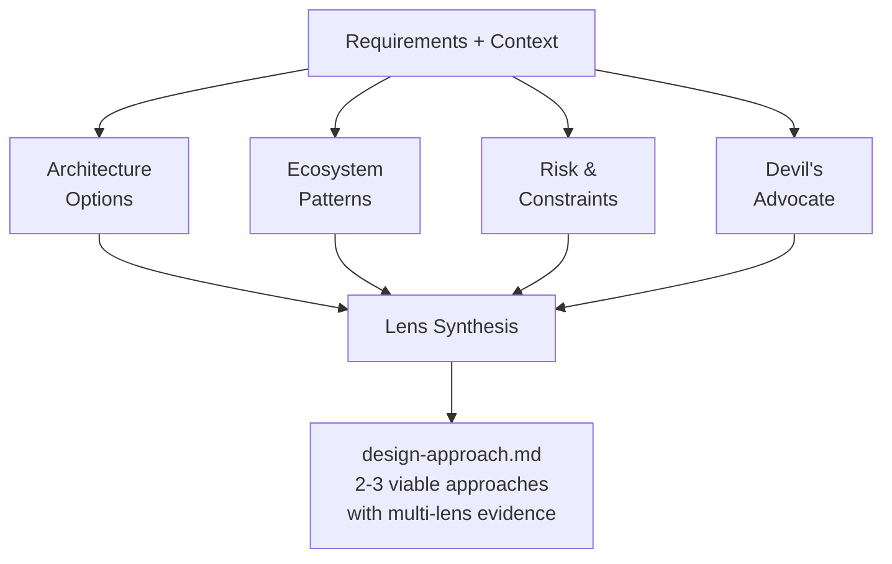
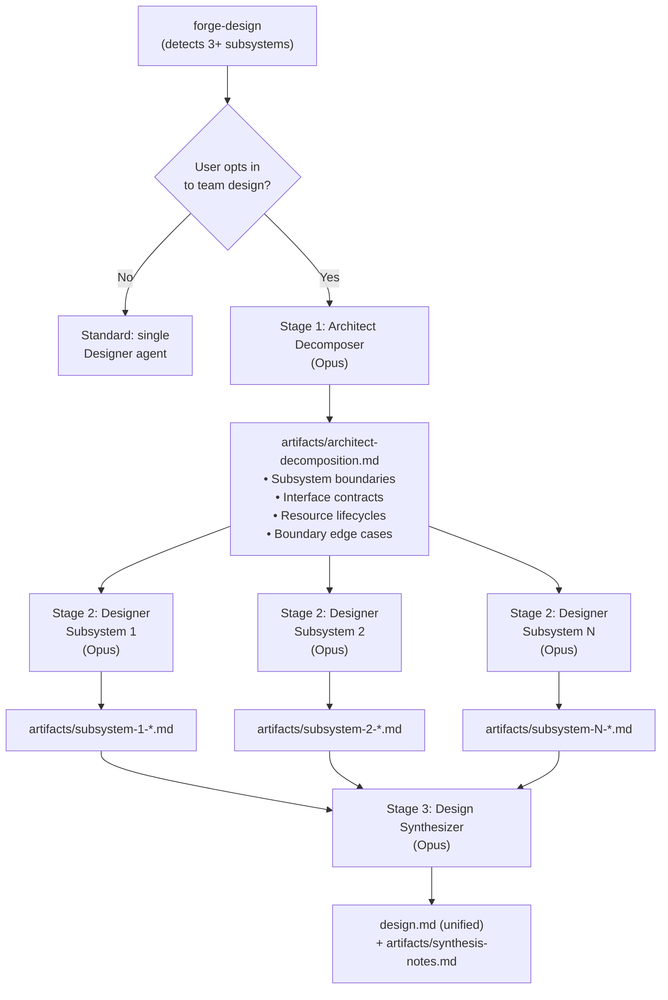
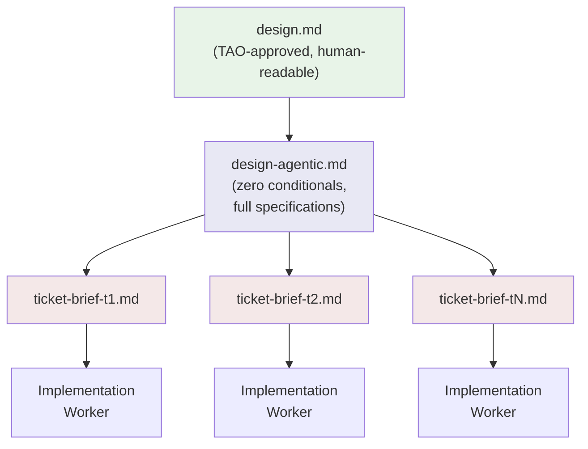
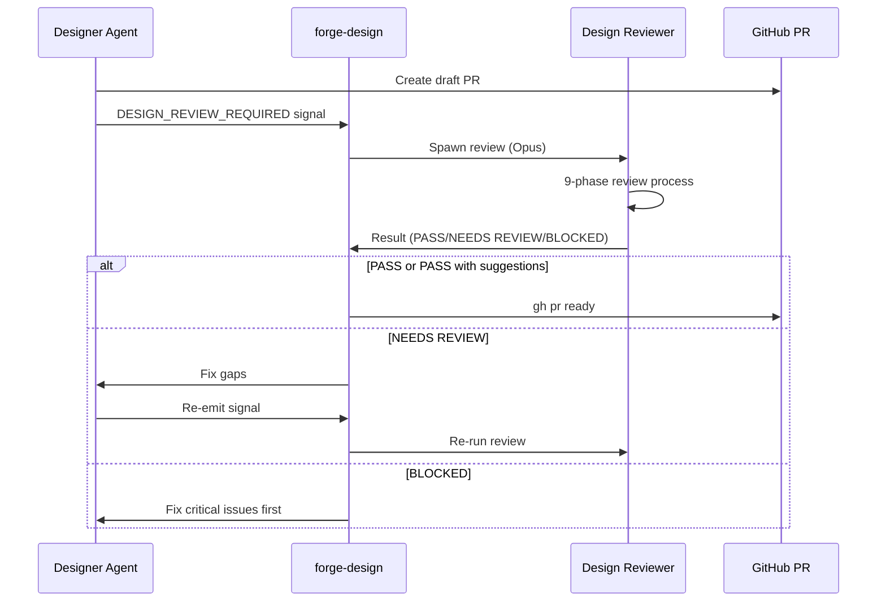

# Design Agent Workflow

The design phase is where Forge's agent orchestration is
most visible. A single `/forge:design` command can spawn
a dozen agents working in parallel — decomposing systems,
exploring architectures, and synthesizing results into a
unified, reviewable design document.

---

## Progressive Design Path

Design flows through three stages, each building on the
last. Not every slice uses all three — small changes may
only need a full design, while complex multi-team features
use the complete progression.

| Mode | Input | Output | Purpose |
|------|-------|--------|---------|
| Approach | Requirements | `design-approach.md` | Explore options |
| Full | Approach + requirements | `design.md` | Complete design |
| Enrich | Approved `design.md` | `design-agentic.md` + briefs | Agent-ready specs |

**Approach** explores 2-3 architectural options through
parallel research lenses. **Full** produces a complete
implementation-ready design through 10+ phases. **Enrich**
adds the zero-conditional-tolerance specifications that
autonomous agents need.

---

## Research Lenses

During approach mode, four parallel perspectives explore
the problem space simultaneously. The calling context
(not the designer itself) spawns these as parallel
subagents via the `parallel-research` skill.

Each lens has a distinct focus:

| Lens | Focus | Output |
|------|-------|--------|
| Architecture Options | 2-3 approaches with trade-offs | Comparison table with `file:line` refs |
| Ecosystem Patterns | How similar systems solve this | Applicability assessment |
| Risk & Constraints | What could go wrong | Risk register + mitigations |
| Devil's Advocate | Challenge assumptions | Per-approach challenges with severity |

The synthesis step is where the real value emerges.
It identifies **agreements** (high-confidence approaches),
**contradictions** between lenses (the most valuable
finding), and **gaps** no lens covered. Approaches that
survive the Devil's Advocate are highlighted as
particularly robust.

### Execution Modes

The `parallel-research` skill detects whether agent teams
are available:

- **Teams available**: Each lens runs as a teammate with
  real-time cross-pollination between perspectives
- **Standard mode**: Lenses run as independent parallel
  subagents
- **Sequential fallback**: When the designer is itself
  a subagent (cannot spawn children), all lenses execute
  sequentially in a single pass

---

## Subsystem Decomposition (Team Design)

For complex slices with 3+ subsystems and cross-boundary
interactions, Forge offers a team-based design path. This
is the fan-out/fan-in pattern at its most elaborate.

### Stage 1: Architect Decomposer

The architect identifies subsystems and defines the
contracts between them. Its 7-step process focuses
80% on **what crosses boundaries** and 20% on internals:

1. Identify subsystems with explicit exclusions
2. Code discovery at subsystem boundaries
3. Define interface contracts (SQL DDL, shared types,
   client interfaces)
4. Map resource lifecycles (creator, users, destroyer,
   startup/shutdown ordering)
5. Flag boundary edge cases (nullable UNIQUE columns,
   cross-subsystem FKs, race conditions)
6. Define shared infrastructure decisions with one
   authoritative owner per concern
7. Write per-subsystem agent briefs with specific
   edge case questions

### Stage 2: Parallel Designers

Each subsystem gets its own Designer agent running in
parallel. These designers run a subset of the full
design phases — they skip architecture exploration
(the architect handled it) and the review gate
(the synthesizer handles it):

| Runs | Skips |
|------|-------|
| Context, code discovery | Approach (0-A) |
| Requirements, guidelines | Architecture (Phase 3) |
| Decisions, components | Rollout (Phase 8) |
| UX, auth, TAO alignment | Review gate (Phase 8c) |
| Task breakdown, testing | |

### Stage 3: Design Synthesizer

The synthesizer's core instinct: "Conflicts are the most
valuable finding. Gaps are the second most valuable."

It merges N subsystem designs through four steps:

1. **Conflict detection** — Interface mismatches,
   contradictory decisions, duplicate functionality
2. **Gap analysis** — Unclaimed requirements, missing
   error paths, integration seams with no owner
3. **Cross-cutting unification** — Settings, lifespan
   ordering, error handling, logging conventions
4. **Vertical slice task breakdown** — Reorganizes
   subsystem-aligned tasks into cross-subsystem
   vertical slices, each independently testable

The synthesizer explicitly avoids subsystem-aligned task
chunks — that would perpetuate the decomposition silos.

---

## Context Cascade

After design is approved by TAO reviewers, the enrich
mode creates progressively more specific artifacts that
give implementation agents exactly what they need.

**`design-agentic.md`** enriches the approved design with
specifications at zero-conditional tolerance — every fact
verified by reading the actual codebase. It contains:

- Design constraints (Must NOT list, assumptions)
- Error handling specification per component
- Data flow maps with concrete types
- Interface contracts with pre/postconditions
- Behavioral specifications (happy + error paths)
- Concrete examples with realistic data
- Decision verification (each decision mapped to a test)

**`ticket-brief-{id}.md`** synthesizes relevant sections
from both `design.md` and `design-agentic.md` into a
standalone brief for a single ticket. The key test:
"Could an agent read only this file and correctly
implement the ticket?"

Each brief contains:
- Task objective
- Design specification (scoped to this ticket)
- Behavioral specs (scoped to this ticket)
- Relevant constraints (curated, not wholesale)
- Acceptance criteria

---

## Design Review Gate

Before any design reaches human TAO reviewers, it passes
through an automated review gate. The designer agent
cannot spawn the reviewer (subagents cannot use Task),
so it emits a structured signal that the calling command
reads and acts on.

The design reviewer runs 9 phases including:

- Requirements and user story coverage
- Specificity check (flagging deferred investigation)
- Approach alignment (if `design-approach.md` exists)
- Scope checks against effort boundaries
- Adversarial analysis (failure modes, assumption audit)
- Internal consistency (SQL columns match DDL, enum
  values match definitions)
- TAO area coverage

Its core instinct: "Am I checking evidence or echoing
assumptions?" This prevents the reviewer from simply
restating what the design says and instead forces it
to verify claims against the actual codebase and
requirements.
