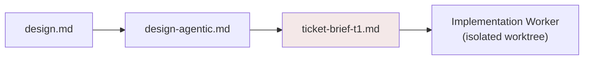
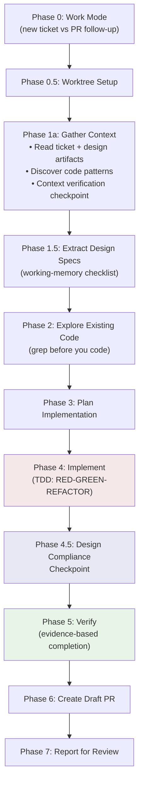
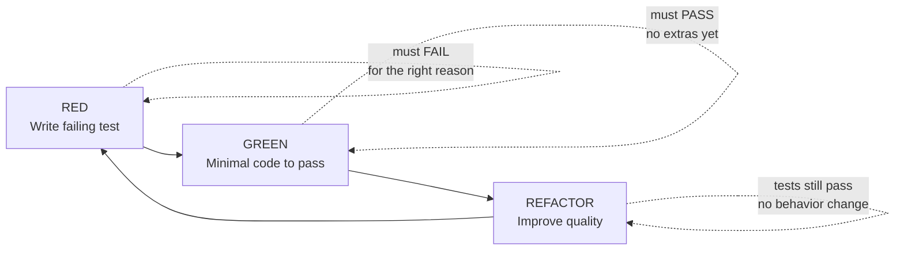
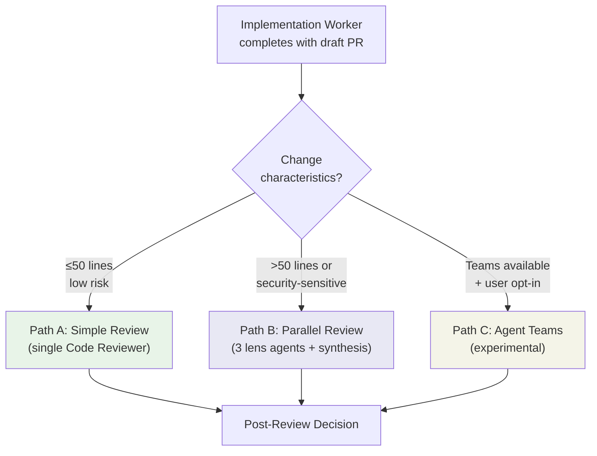
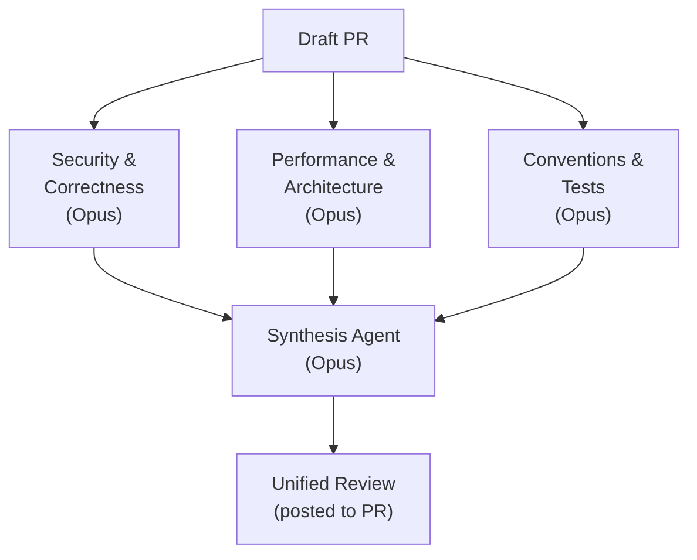
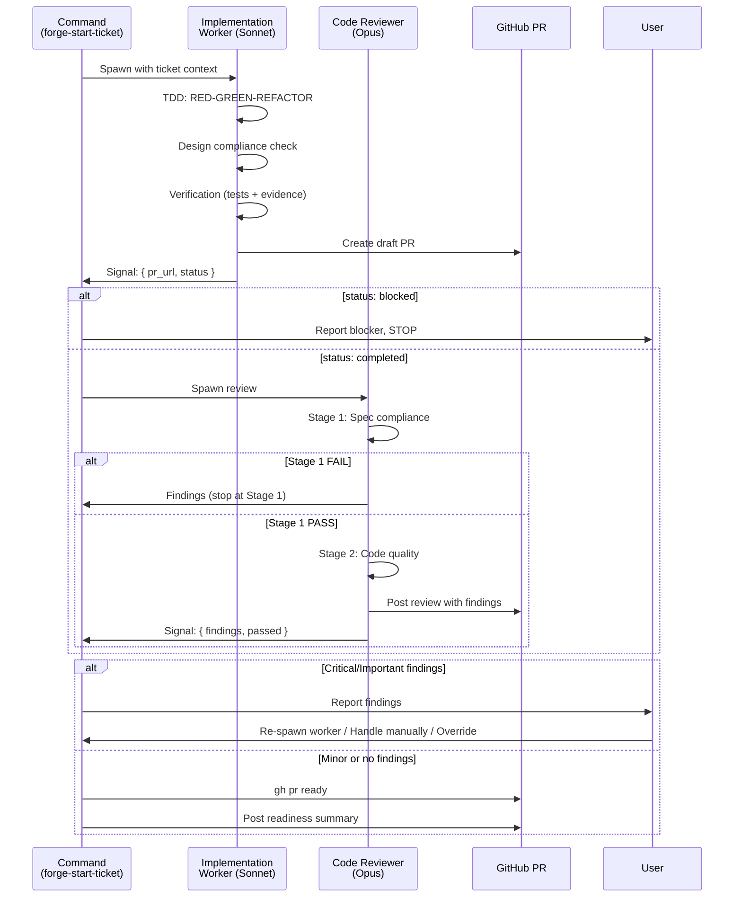

# Implementation & Review Workflow

Implementation in Forge follows a strict delegation model:
the orchestrating command never writes code itself. Instead,
it spawns an Implementation Worker agent that follows TDD
discipline, then gates the result through a code review
before marking the PR ready.

---

## Context Isolation Per Ticket

Each implementation task receives a self-contained brief
that gives the worker everything it needs without loading
the full design. This is the context cascade from the
[design workflow](design-workflow.md) paying off.

The worker's context loading follows a priority cascade:

1. **Ticket brief** (standalone spec — stop here if found)
2. **`design-agentic.md` + `design.md`** (both required)
3. **`design.md` alone** (with a warning)

This means a worker for ticket T3 never sees T1's or T2's
implementation details — only its own brief and the
project's existing codebase patterns.

---

## Implementation Worker Phases

The worker executes 8 phases, from context gathering
through PR creation. Several quality disciplines are
embedded directly in the phase sequence.

### TDD Discipline (Phase 4)

The RED-GREEN-REFACTOR cycle is enforced during
implementation:

**Strong TDD candidates:** Business logic, error handling,
data transformations, API endpoints, database queries.

**Pragmatic exceptions:** Nix expressions (test with
`nix build`), generated code (test the generator),
configuration files (validate with schema), simple
refactors (existing tests provide coverage).

Evidence is captured in commit messages — either
"TDD: RED-GREEN-REFACTOR" or the exception reason.

### Design Compliance Checkpoint (Phase 4.5)

After implementation but before testing, the worker
verifies each spec category against the design:

- Data structures match
- Authorization uses the correct project pattern
- Feature flags all implemented
- Edge cases handled as designed
- API contracts match
- Constants use exact design values

Any accidental deviation is fixed immediately. Intentional
deviations require explicit user approval.

### Verification Before Complete (Phase 5)

"Done" means "verified", not "attempted." The worker must
produce concrete evidence:

| Change Type | Verification |
|------------|--------------|
| Code changes | Test output showing pass |
| Build changes | Build logs showing success |
| Bug fixes | Before (error) and after (clean) |
| Refactors | Full test suite, same count |

Unacceptable evidence: "I think it works", "should be
fine", "tests probably pass."

---

## Code Review Orchestration

After the worker produces a draft PR, the orchestration
skill selects one of three review paths based on the
change characteristics.

### Path A: Simple Review

A single Code Reviewer agent (Opus) runs the full
two-stage review process.

### Path B: Full Parallel Review

Three lens agents run in parallel, each focusing on a
different dimension:

The synthesis step deduplicates findings across lenses,
assigns final severity, and structures the result into
the two-stage review format.

### Two-Stage Review Structure

The Code Reviewer uses a gated review process — Stage 2
only runs if Stage 1 passes.

**Stage 1: Spec Compliance** (gates Stage 2)
- Requirements alignment
- Design alignment
- Test coverage alignment
- Intent coverage (if `intent-spec.md` exists)

**Stage 2: Code Quality** (only if Stage 1 passes)
- Security (Critical)
- Correctness (Critical/Important)
- Error handling (Important)
- Performance (Important)
- Maintainability (Important/Minor)
- Style (Minor)

Severity classification:

| Level | Meaning | Action |
|-------|---------|--------|
| **C** (Critical) | Security, data loss, production-breaking | Block merge |
| **I** (Important) | Maintainability, performance, patterns | Fix or ticket |
| **M** (Minor) | Cosmetic, stylistic | Optional |

---

## Full Pipeline

The complete implement-and-review cycle, showing how
the orchestration skill acts as a thin dispatcher.

### Post-Review Decision Loop

When the review surfaces Critical or Important findings,
the user has three options:

1. **Re-spawn worker** — The worker receives the findings
   and addresses them, then re-enters the review cycle
2. **Handle manually** — The user fixes issues themselves
3. **Override** — Proceed despite findings (rare, for
   time-sensitive situations)

Minor findings or a clean review result in the PR being
marked ready for merge automatically.

---

## Architectural Constraints

Several design decisions enforce the delegation model:

- **Implementation Worker cannot spawn subagents** —
  The Task tool is unavailable to it, preventing it from
  creating its own review pipeline
- **Code Reviewer cannot spawn subagents** — Lens agents
  are spawned by the calling context, not the reviewer
- **Orchestration is a thin dispatcher** — The command
  reads structured signals and makes routing decisions;
  it never analyzes code or synthesizes results itself
- **`bypassPermissions`** is set on both Worker and
  Reviewer spawns for Bash access in non-interactive
  sessions
