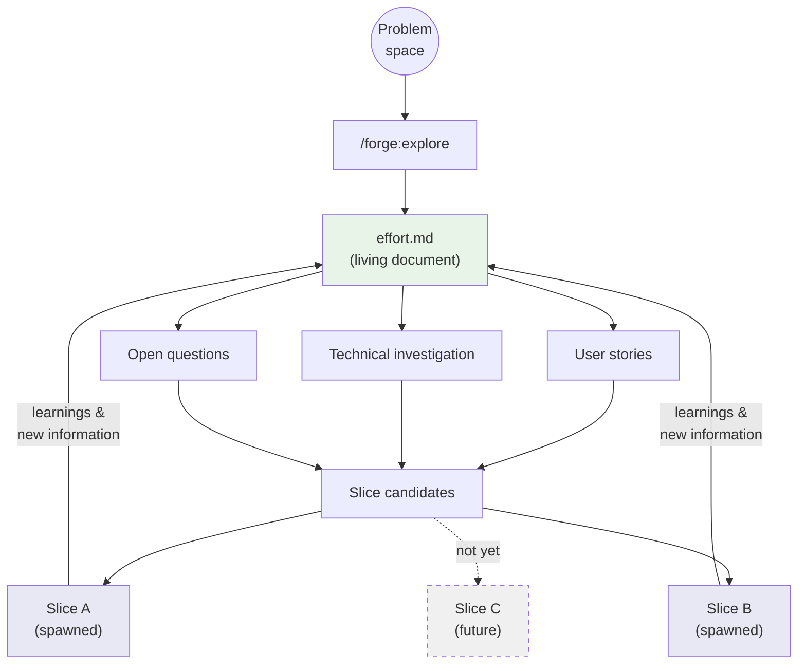
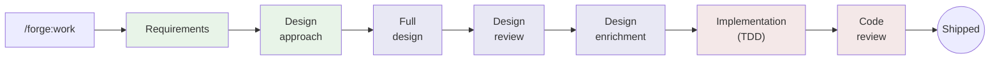

# Workflow Overview

Forge organizes planning work into two container
types: **efforts** and **slices**. Understanding the
difference is the key to using Forge effectively.

---

## The Two Containers

### Efforts: Discovery

An **effort** is where you explore a problem before
committing to a solution. It's a living document
that captures:

- The problem statement and why it matters now
- User stories that emerge from exploration
- Technical requirements discovered along the way
- Open questions and threads under investigation
- Slice candidates — scoped deliverables that
  emerge from the exploration

Efforts don't have a fixed end state. They evolve
as understanding grows. An effort might spawn
multiple slices over time.

**Start an effort when:**
- You have a broad problem to understand
- You're not sure what needs to be built yet
- You want to capture learning before scoping work

### Slices: Delivery

A **slice** is a focused, shippable unit of work
with a defined scope. It moves through structured
phases: requirements, design, and
implementation. A slice has a clear end state —
it's done when all tasks are complete.

**Start a slice when:**
- The problem is well-understood
- You can define acceptance criteria
- The work fits in a few weeks

---

## Effort Lifecycle

An effort is iterative. Discovery feeds candidates,
candidates become slices, and slices feed learnings
back into the effort.



Efforts don't end when slices ship. Completed slices
often surface new understanding that updates the effort
and reveals new candidates.

## Slice Lifecycle

A slice moves through structured phases. Each phase
has a gate before the next begins.



---

## The Phases

### Phase 1: Requirements

Requirements capture what you're building and why.
A good requirements document includes:

- Summary of what the slice delivers
- Success criteria (specific and testable)
- Scope boundaries (in scope and out of scope)
- Affected components and who owns them
- Open questions to resolve before design

Run `/forge:requirements` to start this phase with
an AI-assisted conversation that drafts the document.

**Phase complete when:** A requirements review exists.

### Phase 2: Design

Design captures how you'll build it.

A good design document includes:

- Architecture overview
- Component changes
- API changes
- Alternatives considered
- Testing strategy
- Task breakdown

Run `/forge:design` to start this phase.

**Phase complete when:** A design review exists.

### Phase 3: Implementation

Implementation is where the work gets done. Tasks
from the design (or requirements) are tracked in
`tasks.md`.

Run `/forge:start-task` to begin work on a specific
task. This sets up the working context and helps
track progress.

**Phase complete when:** All tasks are done.

---

## Retro Notes and Continuous Improvement

One of Forge's most powerful features is its
self-improving workflow. As you work, you capture
observations:

```
/forge:retro-note
```

> "The requirements template doesn't have a section
> for external dependencies."

Later, you apply those notes as real improvements:

```
/forge:improve
```

Forge reviews your retro notes and applies them to
the relevant templates, context files, and guidelines.
Over time, your Forge setup reflects your team's
actual practices — not generic defaults.

---

## Worktree Workflow

All effort and slice work happens in git worktrees.
Forge commands create worktrees automatically — you
don't need to manage them manually. This keeps `main`
clean and lets multiple pieces of work proceed in
parallel without conflicts.

When you run `/forge:work new` or `/forge:explore init`,
Forge creates a worktree under `_worktrees/` with an
ephemeral branch. Work happens there, gets committed
and pushed, then merges back to main via PR.

---

## Directory Structure

After running `/forge:init` and creating some work,
your `.forge-context/` directory looks like:

```
.forge-context/
  context/
    product.md         # what your project does
    components.md      # key modules
    team.md            # contributors and areas
    principles.md      # engineering principles
    git-workflow.md    # branching strategy
  efforts/
    202601-auth-rework/
      effort.md
      slices.md
      decisions.md
      checklist.md
  slices/
    202602-login-flow/
      requirements.md
      design.md
      tasks.md
      decisions.md
      checklist.md
      reviews/
  artifacts/           # agent analysis outputs
  overrides/
    terminology.md     # your team's term mappings
  templates/           # copies for new work
```

All files are plain markdown. Commit them with your
code — they're part of your project's knowledge base.

---

## Deep Dives

These documents explore the agent orchestration patterns
behind each workflow phase:

- **[Design Workflow](design-workflow.md)** — Progressive
  design path, parallel research lenses, subsystem
  decomposition with fan-out/fan-in, context cascade
  from design to ticket briefs, and the automated
  design review gate

- **[Implementation & Review Workflow](implementation-workflow.md)**
  — Context isolation per ticket, TDD discipline,
  design compliance checkpoints, three code review
  paths (simple, parallel, teams), and the post-review
  decision loop

- **[Commit Restructuring Workflow](commit-workflow.md)**
  — Review concern organization, the Story Architect
  and Commit Builder pipeline, zero loss guarantee,
  and review depth classification
